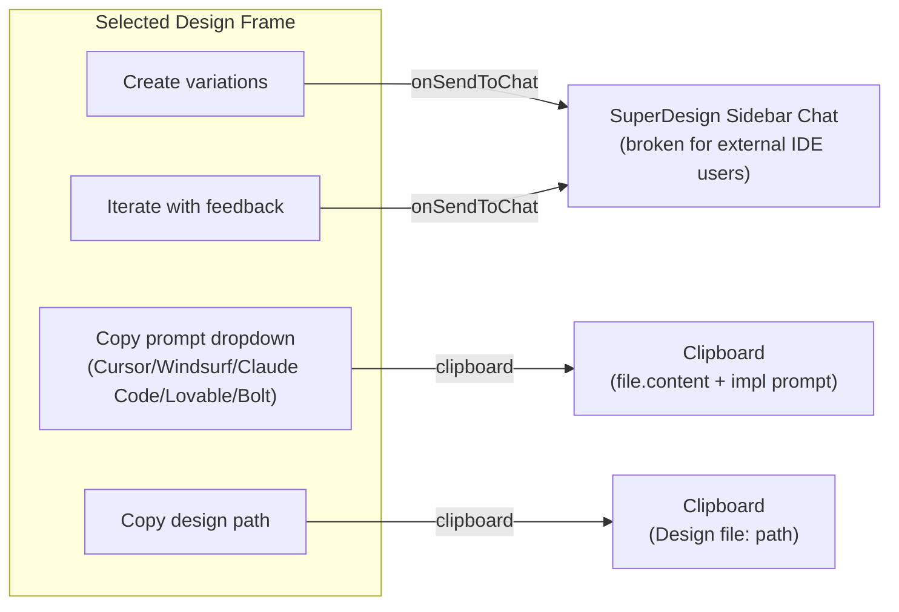
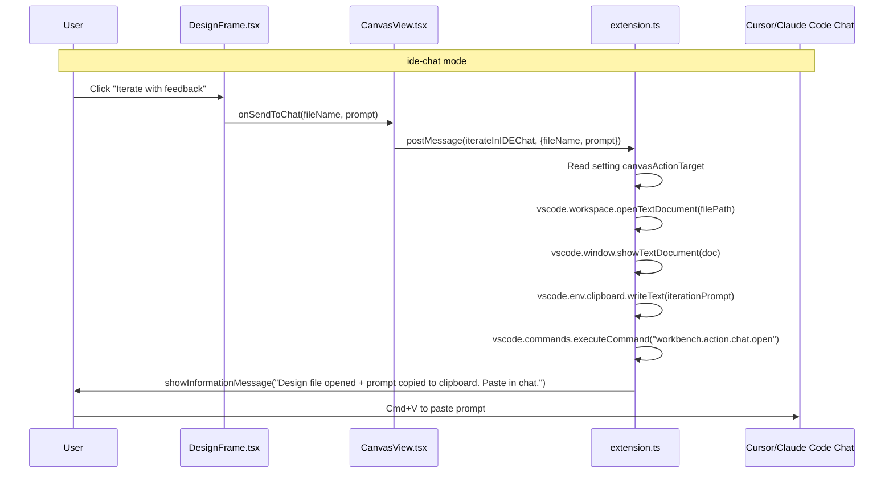

# Canvas IDE-Chat Integration

## Problem

The canvas has 5 action buttons on each selected design frame. Two of them — **Create variations** and **Iterate with feedback** — are hardwired to the SuperDesign sidebar chat. When a user is working in Cursor's built-in chat or Claude Code, clicking these buttons does nothing useful.

## Complete Canvas Action Inventory




**Current flow for A and B** (broken for Cursor users):
`DesignFrame.onSendToChat` → `CanvasView.handleSendToChat` → `postMessage(setChatPrompt)` → `extension.ts` → `sidebarProvider.sendMessage(setChatPrompt)` → SuperDesign chat sidebar sets input text

**C and D already work** via `navigator.clipboard.writeText()` — no extension host involvement.

## Solution: Dual-Mode Canvas Actions

Add a VS Code setting `superdesign.canvasActionTarget` (`'superdesign-chat'` | `'ide-chat'`, default `'superdesign-chat'`). When set to `'ide-chat'`:

- **Create variations** and **Iterate with feedback** → open the design file in the editor + copy a formatted iteration prompt to clipboard + show a VS Code notification with instructions
- **Copy prompt dropdown** → add a new "Design iteration" section with iteration-specific prompts (separate from the existing implementation prompts)
- **Copy design path** → no change needed (already works)

This is the only viable approach because VS Code has no public API to programmatically inject text into Cursor's chat input or another extension's chat panel.

## Architecture




## Changes Required

### 1. [package.json](package.json) — New setting

Add to `contributes.configuration.properties`:

```json
"superdesign.canvasActionTarget": {
  "type": "string",
  "enum": ["superdesign-chat", "ide-chat"],
  "enumDescriptions": [
    "Route canvas iteration actions to the SuperDesign sidebar chat",
    "Route canvas iteration actions to the IDE's built-in chat (Cursor, Claude Code, etc.) via clipboard"
  ],
  "default": "superdesign-chat",
  "description": "Where to send design iteration actions from the canvas",
  "scope": "application"
}
```

### 2. [src/extension.ts](src/extension.ts) — New message handler branch

In the canvas panel's `onDidReceiveMessage` handler (~line 1629), add a new case alongside `setChatPrompt`:

```typescript
case 'iterateInIDEChat': {
    const config = vscode.workspace.getConfiguration('superdesign');
    const target = config.get<string>('canvasActionTarget', 'superdesign-chat');
    
    if (target === 'ide-chat') {
        const { fileName, prompt, filePath } = message.data;
        // 1. Open the design file in editor so it's in context
        const doc = await vscode.workspace.openTextDocument(filePath);
        await vscode.window.showTextDocument(doc, { preview: true });
        // 2. Build iteration prompt with file reference
        const iterationPrompt = `I'm looking at the design file: ${filePath}\n\n${prompt}`;
        // 3. Copy to clipboard
        await vscode.env.clipboard.writeText(iterationPrompt);
        // 4. Try to open IDE chat panel
        await vscode.commands.executeCommand('workbench.action.chat.open');
        // 5. Notify user
        vscode.window.showInformationMessage(
            'Design file opened and iteration prompt copied to clipboard. Paste it in the chat.',
            'OK'
        );
    } else {
        // Fall back to existing sidebar chat behavior
        this._sidebarProvider.sendMessage({ command: 'setChatPrompt', data: message.data });
    }
    break;
}
```

### 3. [src/webview/components/CanvasView.tsx](src/webview/components/CanvasView.tsx) — New message type

Update `handleSendToChat` to use a new `iterateInIDEChat` command instead of `setChatPrompt`:

```typescript
const handleSendToChat = (fileName: string, prompt: string) => {
    const selectedFile = designFiles.find(file => file.name === fileName);
    const filePath = selectedFile ? selectedFile.path : fileName;
    
    vscode.postMessage({
        command: 'iterateInIDEChat',
        data: { fileName, prompt, filePath }
    });
};
```

The extension host then decides whether to route to sidebar chat or IDE chat based on the setting. The `setContextFromCanvas` call is removed from this handler since it's only relevant to the SuperDesign sidebar.

### 4. [src/webview/components/DesignFrame.tsx](src/webview/components/DesignFrame.tsx) — Iteration prompts in copy dropdown

The existing "Copy prompt" dropdown copies `file.content + implementation prompt`. Add a second section for **design iteration prompts** (no file content, just path reference + iteration instruction) so users can also copy these for Cursor/Claude Code:

```
Copy prompt dropdown:
├── [Implement in...] section (existing)
│   ├── Cursor
│   ├── Windsurf
│   ├── Claude Code
│   ├── Lovable
│   └── Bolt
└── [Iterate design in...] section (new)
    ├── Cursor
    ├── Claude Code
    └── Windsurf
```

Iteration prompt format (no file content, just path + instruction):

```
Design file: {file.path}

Please read this design file and create variations with the following improvements: [user fills in]
Save new versions as {design_name}_v{n}.html in the same .superdesign/design_iterations/ folder.
```

### 5. [src/extension.ts](src/extension.ts) — Enhanced rule files for external agents

The current `designRuleContent` (line 257) references `generateTheme` as a tool, but Cursor/Claude Code don't have this tool. Update the rule content to:

- Replace `generateTheme tool` references with "write a CSS file to `.superdesign/design_iterations/theme_*.css`"
- Add explicit iteration instructions: "When iterating on an existing design, read the file first, then write a new version as `{name}_v{n}.html`"
- Add `AGENTS.md` generation (OpenAI Codex CLI convention) alongside `CLAUDE.md`

## Files Changed

- [package.json](package.json) — add `canvasActionTarget` setting
- [src/extension.ts](src/extension.ts) — add `iterateInIDEChat` message handler, update rule file content, add `AGENTS.md` generation
- [src/webview/components/CanvasView.tsx](src/webview/components/CanvasView.tsx) — update `handleSendToChat` to use `iterateInIDEChat`
- [src/webview/components/DesignFrame.tsx](src/webview/components/DesignFrame.tsx) — add "Iterate design in..." section to copy dropdown
- [src/webview/types/canvas.types.ts](src/webview/types/canvas.types.ts) — add `IterateInIDEChatMessage` type

## What Stays Unchanged

- SuperDesign sidebar chat — still works exactly as before when `canvasActionTarget = 'superdesign-chat'`
- Canvas file watching — unchanged, still watches `.superdesign/design_iterations/`
- All viewport, zoom, drag, layout controls — unchanged
- The existing "Copy prompt" implementation dropdown — unchanged, just a new section added
- "Copy design path" button — unchanged

