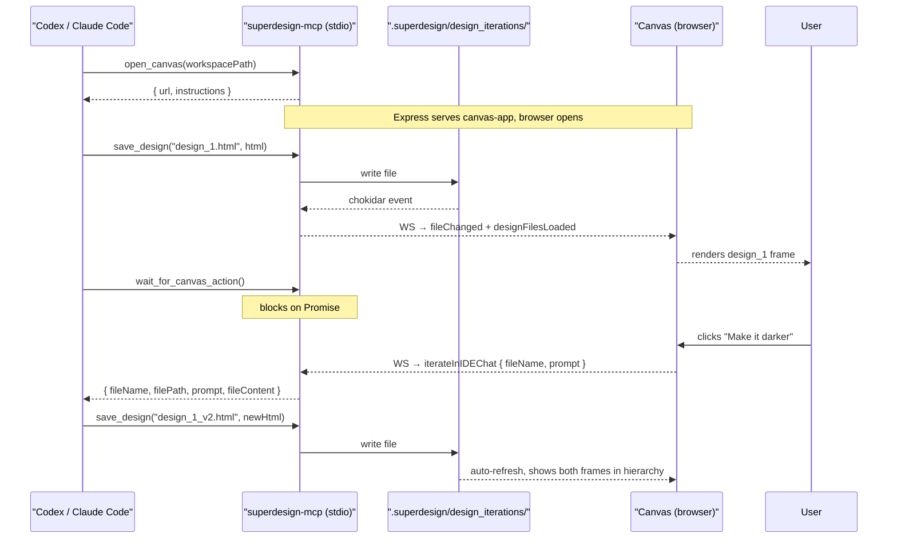

# Superdesign MCP Monorepo Plan

## Goal

Extract the canvas into a shared package, build an MCP server that serves it as a local web app, and wire user canvas clicks back to the CLI agent as tool responses — all without touching the VS Code extension's behavior.

## Monorepo Structure

```
superdesign/                          ← repo root
  package.json                        ← npm workspaces root
  packages/
    canvas-app/                       ← shared React canvas (extracted)
      src/
        components/                   ← CanvasView, DesignFrame, ConnectionLines, Icons
        utils/                        ← gridLayout.ts
        types/                        ← canvas.types.ts
        transport/
          vscode.transport.ts         ← wraps acquireVsCodeApi() + postMessage
          websocket.transport.ts      ← wraps WebSocket for standalone mode
          transport.interface.ts      ← ITransport interface
        index.tsx                     ← entry, reads data-transport attr to pick transport
      package.json
    mcp-server/                       ← npx superdesign-mcp
      src/
        server.ts                     ← MCP stdio server, tool definitions
        canvas-server.ts              ← Express + ws + chokidar
        tools/
          open_canvas.ts
          load_designs.ts
          save_design.ts
          wait_for_canvas_action.ts
      package.json                    ← "bin": { "superdesign-mcp": "./dist/server.js" }
  apps/
    vscode-extension/                 ← current src/ moved here (minimal changes)
      src/
        extension.ts                  ← unchanged logic, imports from canvas-app build
      package.json                    ← engines.vscode, publisher, etc.
```

## Transport Abstraction (the key change)

Currently `CanvasView.tsx` calls `vscode.postMessage(...)` and `window.addEventListener('message', ...)` directly. This gets replaced with a thin `ITransport` interface:

```typescript
// packages/canvas-app/src/transport/transport.interface.ts
export interface ITransport {
  send(message: WebviewMessage): void;
  onMessage(handler: (msg: ExtensionToWebviewMessage) => void): void;
}
```

- `VscodeTransport` — wraps `acquireVsCodeApi()` exactly as today
- `WebSocketTransport` — connects to `ws://localhost:{PORT}`, same message shapes

`index.tsx` reads `data-transport="vscode|websocket"` and `data-ws-port="{PORT}"` from `#root` to pick the transport at runtime. No component code changes.

## MCP Server — 4 Tools

```
open_canvas(workspacePath)
  → starts Express on a free port
  → serves canvas-app build (static)
  → starts chokidar watcher on .superdesign/design_iterations/
  → opens browser
  → returns { url, port, instructions }
    instructions tells the agent: save files here, call wait_for_canvas_action after each save

load_designs(workspacePath)
  → reads .superdesign/design_iterations/*.{html,svg}
  → pushes designFilesLoaded message to canvas via WebSocket
  → returns { files: DesignFile[] }

save_design(filePath, content)
  → writes file to .superdesign/design_iterations/
  → chokidar fires → canvas auto-refreshes
  → returns { saved: true }

wait_for_canvas_action()
  → holds a Promise until canvas sends iterateInIDEChat over WebSocket
  → resolves with { fileName, filePath, prompt, fileContent }
  → agent receives this and treats it as the next design instruction
```

## Full Interaction Flow




## MCP Config (user adds once)

```json
{
  "mcpServers": {
    "superdesign": {
      "command": "npx",
      "args": ["-y", "superdesign-mcp"]
    }
  }
}
```

## open_canvas Response Carries Workflow Instructions

No `AGENTS.md` required. The `open_canvas` tool response embeds the workflow:

```json
{
  "url": "http://localhost:3847",
  "instructions": "Canvas open. Workflow: 1) save_design(path, html) to create/update designs under .superdesign/design_iterations/ using naming design_1.html → design_1_v2.html for iterations. 2) call wait_for_canvas_action() after each save — do not proceed until it resolves. 3) treat the returned prompt as the next design instruction."
}
```

An optional `AGENTS.md` template can be shipped in the repo for users who want project-level customization.

## Build Setup

- Root `package.json` uses npm workspaces: `["packages/*", "apps/*"]`
- `canvas-app` builds with esbuild to `dist/` (same config as current webview build, minus the `acquireVsCodeApi` assumption)
- `vscode-extension` build copies `canvas-app/dist/webview.js` instead of building it inline — or keeps its own esbuild entry pointing at `canvas-app/src/index.tsx`
- `mcp-server` builds with esbuild to `dist/server.js`, published to npm as `superdesign-mcp`

## What Changes vs What Stays the Same

**Unchanged:**

- All React component logic (`CanvasView.tsx`, `DesignFrame.tsx`, `ConnectionLines.tsx`, `gridLayout.ts`)
- All message type definitions in `canvas.types.ts`
- VS Code extension behavior, commands, file watcher logic
- Extension publish pipeline

**Changed (minimal):**

- `CanvasView.tsx`: replace `vscode.postMessage` / `window.addEventListener('message')` calls with `this.transport.send()` / `this.transport.onMessage()` — ~10 call sites
- `App.tsx`: replace `acquireVsCodeApi()` with transport factory call
- Move files into monorepo structure

**New:**

- `transport.interface.ts`, `vscode.transport.ts`, `websocket.transport.ts`
- `packages/mcp-server/` (~400 lines total)
- Root `package.json` workspace config

